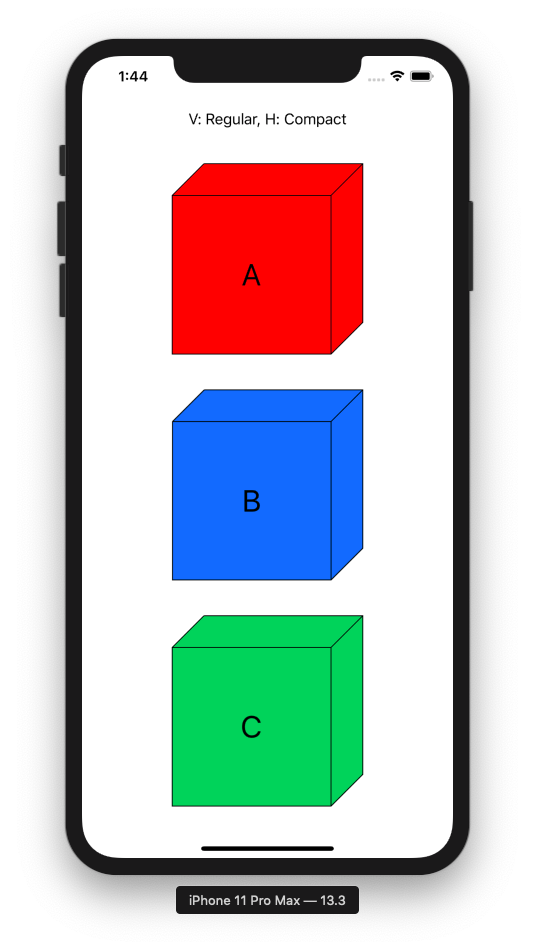
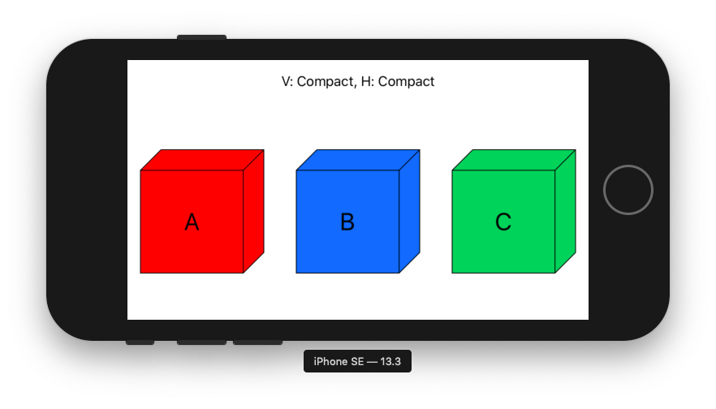
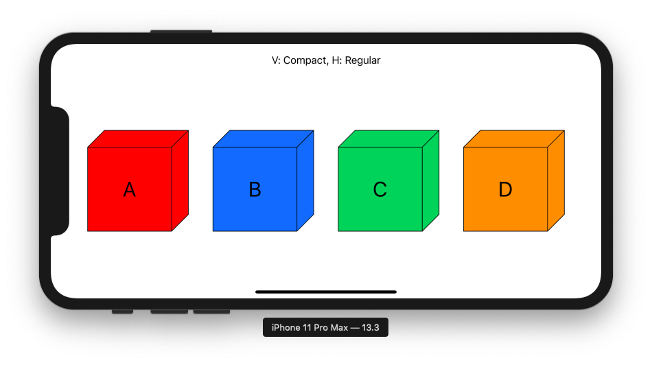

# SwiftUI with Size Classes

In SwiftUI, there is no built-in easy way to know the device screen sizes and orientations (portrait or landscape).

But there is something better: Size Classes. Size Class allow you to take in account more than just device orientation.

For instance, iPad allows you to do Multitasking by splitting the screen in 1/3, 2/3. So the app has to respond to this change. Size Classes can help.

And yes there is a built-in access to current Size Classes in SwiftUI.

Moreover, it seems to be the new recommendations from Apple Human Interface Guidelines: https://developer.apple.com/design/human-interface-guidelines/ios/visual-design/adaptivity-and-layout/

## Access to current Size Classes

Access to Size Classes is very simple in SwiftUI, it changes automatically if the user change the device orientation or split the view with iPad Multitasking thanks to `@Environment` wrapper.

```swift
struct ContentView: View {
    @Environment(\.verticalSizeClass) var verticalSizeClass: UserInterfaceSizeClass?
    @Environment(\.horizontalSizeClass) var horizontalSizeClass: UserInterfaceSizeClass?

    var body: some View {
        Group {
            if verticalSizeClass == .regular && horizontalSizeClass == .compact {
                // iPhone Portrait or iPad 1/3 split view for Multitasking for instance
                ...
            } else if verticalSizeClass == .compact && horizontalSizeClass == .compact {
                // some "standard" iPhone Landscape (iPhone SE, X, XS, 7, 8, ...)
                ...
            } else if verticalSizeClass == .compact && horizontalSizeClass == .regular {
                // some "bigger" iPhone Landscape (iPhone Xs Max, 6s Plus, 7 Plus, 8 Plus, ...)
                ...
            } else if verticalSizeClass == .regular && horizontalSizeClass == .regular {
                // macOS or iPad without split view - no Multitasking
                ...
            }
        }
    }
}
```

I illustrated all possiblities with examples and screenshots bellow.

You can also download and run this project with Xcode in differents simulators to see the differences.

## Vertical Regular, Horizontal Compact. E.g. iPhone Portrait and iPad 1/3 split view for Multitasking

```swift
if verticalSizeClass == .regular && horizontalSizeClass == .compact {
    // iPhone Portrait or iPad 1/3 split view for Multitasking for instance
    // A
    // B
    // C
    VStack {
        Text("V: Regular, H: Compact").padding()
        Spacer()
        VStack {
            CubeView(letter: "A").padding()
            CubeView(letter: "B").padding()
            CubeView(letter: "C").padding()
        }
        Spacer()
    }
}
```



## Vertical Compact, Horizontal Compact. E.g. "Standard" iPhone Landscape

```swift
if verticalSizeClass == .compact && horizontalSizeClass == .compact {
    // some "standard" iPhone Landscape (iPhone SE, X, XS, 7, 8, ...)
    // A B C
    VStack {
        Text("V: Compact, H: Compact").padding()
        Spacer()
        HStack {
            CubeView(letter: "A").padding()
            CubeView(letter: "B").padding()
            CubeView(letter: "C").padding()
        }
        Spacer()
    }
}
```


## Vertical Compact, Horizontal Regular. E.g. "Bigger" iPhone Landscape

```swift
if verticalSizeClass == .compact && horizontalSizeClass == .regular {
    // some "bigger" iPhone Landscape (iPhone Xs Max, 6s Plus, 7 Plus, 8 Plus, ...)
    // A B C D
    VStack {
        Text("V: Compact, H: Regular").padding()
        Spacer()
        HStack {
            CubeView(letter: "A").padding()
            CubeView(letter: "B").padding()
            CubeView(letter: "C").padding()
            CubeView(letter: "D").padding()
        }
        Spacer()
    }
}
```


## Vertical Regular, Horizontal Regular. E.g. iPad fullscreen, iPad 1/2 split view, macOS

```swift
if verticalSizeClass == .regular && horizontalSizeClass == .regular {
    // macOS or iPad without split view - no Multitasking
    // A B
    // C D
    VStack {
        Text("V: Regular, H: Regular").padding()
        Spacer()
        HStack {
            CubeView(letter: "A").padding()
            CubeView(letter: "B").padding()
        }
        HStack {
            CubeView(letter: "C").padding()
            CubeView(letter: "D").padding()
        }
        Spacer()
    }
}
```


